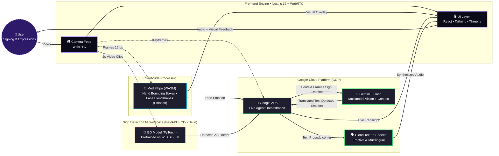

# 🤟 SignPulse AI

   

**Live Demo:** [https://signpulse-ai-om4pzzzkja-uc.a.run.app](https://signpulse-ai-om4pzzzkja-uc.a.run.app)  
_Note: Please grant camera and microphone permissions when testing the application._

---

## 🎯 The Problem

Current sign language translation tools act like simple dictionaries, translating signs word-for-word. They miss crucial elements of human communication: **emotion, tone, and environmental context**. Without these, translations feel robotic and lose the nuance that native signers convey through facial expressions and body language.

## ✨ The Solution: SignPulse AI

SignPulse AI is a real-time, vision-enabled Live Agent that bridges the communication gap. It doesn't just translate hands—it translates the _person_.

By utilizing a **Dual-Pipeline Architecture**, SignPulse simultaneously tracks precise ASL signs via a custom PyTorch model and detects facial emotions via client-side WASM. This context is fed into **Google's Gemini 3 Flash** via the **Google ADK**, producing context-aware translations spoken aloud with emotive, dynamic text-to-speech.

### Key Features

- **👐 Real-Time ASL Detection:** Uses an I3D model trained on the WLASL-300 dataset for robust sign recognition.
- **😊 Emotion & Tone Mapping:** MediaPipe detects facial blendshapes client-side to infer emotion (happy, angry, confused, etc.), which is used to modulate the synthesized voice pitch and speed.
- **👁️ Environmental Context:** Gemini analyzes the background environment to contextualize the conversation.
- **🌍 Multilingual:** Instantly translates signs into 20+ spoken languages.
- **🚀 Mind-Blowing UI:** Immersive frontend featuring Three.js particle backgrounds, glassmorphism, floating emoji graffiti, and a responsive design.

---

## 🏗️ Architecture & Engine Flow

The application runs a unique dual-pipeline constraint:

1. **Client-Side WASM (MediaPipe):** Runs at ~15fps capturing hand bounding boxes and mapping facial blendshapes to emotions.
2. **Backend Microservice (FastAPI + I3D):** Captures 2-second overlapping video clips, sending them to a dedicated Cloud Run service for ASL intent prediction.
3. **Orchestration (Google ADK + Gemini):** Binds the visual frame, the detected ASL intent, and the detected face emotion to provide a highly accurate, human-like interpretation.



---

## 🛠️ Technology Stack

**Frontend**

- Next.js 16 (App Router + Turbopack)
- React 19
- Tailwind CSS v4
- Three.js (`@react-three/fiber`, `@react-three/drei`)
- MediaPipe (`@mediapipe/tasks-vision` via WASM)

**Backend / Cloud**

- **Google ADK** (`@google/adk`)
- Google Vertex AI (Gemini 3 Flash API)
- Google Cloud Text-to-Speech
- Google Cloud Run (Containerized deployment)

**Sign Detection Microservice**

- FastAPI
- PyTorch (Inflated 3D ConvNet - I3D)
- OpenCV

---

## 🚀 Running Locally

### 1. Main Next.js App

Clone the repository and install dependencies:

```bash
npm install
```

Set up your `.env` file:

```env
# Path to your GCP service account JSON key with Vertex AI and TTS permissions
GOOGLE_APPLICATION_CREDENTIALS="service-account.json"

# Deployed Sign API URL
NEXT_PUBLIC_SIGNPULSE_API="https://signpulse-backend-973006952011.us-central1.run.app"
```

Start the development server:

```bash
npm run dev
```

### 2. Sign Detection Microservice (Optional)

If you want to run the python modeling backend locally instead of using the deployed Cloud Run instance:

```bash
cd sign-api
python -m venv venv
source venv/bin/activate  # On Windows: .\venv\Scripts\activate
pip install -r requirements.txt
uvicorn main:app --reload --port 8000
```

_(You will need to place your WLASL `wlasl_model.pth` checkpoint inside the `sign-api` directory)._

---

## 👥 Team Members and Contributors

- Monika Dineshbhbai Patel
- Rudriben PatanjaliKumar Trivedi
- Vraj Manishkumar Patel
- Dhruv Rakeshkumar Mojila
